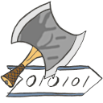

# HackaGames - An Hackable Games' Engine



**HackaGames** aims to be an open game engine dedicated for the development of Artificial Intelligence (AIs) in any languages.
The project is based on a communication protocols relying on *ZeroMQ* and is developed accordingly to [KISS](https://fr.wikipedia.org/wiki/Principe_KISS) (Keep It Stupid Simple) principle.
The main feature of this project is to permits the game, players and AIs to works on their own process potentially distributed over differents machines.
In other terms, **HackaGames** implement a simple client/server architecture to permit AI to take a seat on a game through a simple communication protocol.

**HackaGames** is seen as an API for game development.
Several games are proposed with the API for example:

- **421**: A very simple one player dice game to get the concept of AI implementation (not a core HackaGames client/server game).
- **TicTacToe**: Classic and Ultimate _TicTacToe_ game

## Concurency:

**HackaGame** is not what you looking for ? Try those solutions:

- https://ludii.games/ "a general game system designed to play, evaluate and design a wide range of games" (JAVA)
- https://www.pommerman.com/ an hackable Bomberman game (Python)
- https://www.codingame.com web-based environment for *NPC* development (complete solution but not open).

## License

**HackaGame** is distributed under the [MIT license](./LICENCE.md).
This API comme with absolutly no guarantee.

## Installation

**HackaGames** is natively developed on and for Linux systems.
Commands are given regarding Ubuntu-like distribution.
However, **HackaGames** is packaged in several levels where the level one is only relaing to `python3` language.
This way level one will supported what ever our favorit operating system supporting `python3`.


### Level one (python)

Level one consist in making the **hakapy** `python3` module working.
The network protocol of **HackaGames** relies on `zmq` library.
So first get the dependancy for instance via `pip`.

```sh
pip3 install zmq
```

That it.
You can play to several of the games (the ones developped on top of `hackapy`), and implement some IA (Games: [421](./game-421), [tictactoe](./game-tictactoe) or [risky](./game-risky)) in `python`


### Level two (C)

Level two consist in compaling the **C** **hakalib** and the games built on top of the **C** lib.

Actually the **Level two** is desactivated...

**HackaGames** is natively developed on and for Linux systems.
Commands are given regarding Ubuntu-like distribution.

The classical way to get **HackaGames** is to clone then buid the project.
So first, you can clone this repository (game engine plus games):

```bash
git clone https://bitbucket.org/imt-mobisyst/hackagames.git
cd hackagames
```

The short way: 

```bash
./bin/install-dependencies
./bin/build
```
For the detailled way, see [install documentation](./doc/hacka-01-install.md)

## Getting started

The easiest way is to enter in one of the example games as [421 game](./game-421/README.md).

## In this repository

Directories:

- *bin* : scripts for project management.
- *.git* : git version management directory.
- *dpd* : (generated files) included dependencies (RayLib and potentionnaly in the future: Wanda / Mosquitto / Igraph / ... )
- *doc* : some documentation of the project (to be generated).
- *hackalib* : Librairy and tools like interfaces in different programing language to help connect a game.
- *hackapy* : Python version of the librairy and tools.
- *game-** : game examples on the top of **HackaGames** API.
- *resources* : some resources to illustrate **HackaGames** project.

Root Files:

- *README.md* : Your servitor.
- *LICENCE.md* : The Applied MIT license.
- *CMakefile* : Instructions for `CMake` construction


### Contributors

- Permanent contributor:
  * **Guillaume LOZENGUEZ** - [guillaume.lozenguez@imt-nord-europe.fr](mailto:guillaume.lozenguez@imt-norrd-europe.fr)
