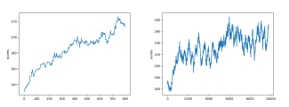
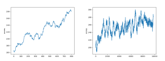
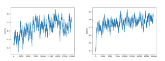

# Converging

The idea is to highlight the capability an AI has to increase it behavior.
One way to do that is to plot it score in game while the AI increase its ability to play.
Ideally, we can observe an increasing asymptotic curve toward it maximal theoretical limit.
In that case we can assume that the AI converged.


## Prerequisite

This tutorial suppose that you already performed the **Initiation Autonomous Systems - tutorials** and specially the **Reinforcement Learning** tutorial. 
However, every applied  learning method.

We will start from the `launcherPy421.py` to visualize the behavior of `myPy421RLearner.py`.

Actually, the `launcherPy421.py` run a certain number of games with a `myPy421RLearner.py` `Player`.
The script lookalike: 

```python
#!env python3
from hackagames.gamePy421.gameEngine import GameSolo as Game
from tutos.myPy421RLearner import AutonomousPlayer as Player

import matplotlib.pyplot as plt

# Instanciate and start 100 games
game= Game()
player= Player()
results= game.testPlayer( player, 1000 )

# Annalisis
average= sum(results)/len(results)
print( f"Average score: {average}" )
```

## Plotting with PyPlot

_Matplotlib_ is a plotting library for the Python programming language and its numerical mathematics extension NumPy. It provides an object-oriented API for embedding plots into applications using general-purpose GUI toolkits.
In this library, _PyPlot_ is certainly the most used component (it is the visible part of the iceberg).
It proposes friendly primitive to easily plot data.

More on [W3Schools](https://www.w3schools.com/python/matplotlib_pyplot.asp).

First we have to include the resource `import matplotlib.pyplot as plt` on our launcher.
Then we can plot the resulting scores using `plot()` and `show()`.

```python
plt.plot( results )
plt.ylabel( "scores" )
plt.show()
```

Then launch your experiment:.

```sh
python3 ./launcherPy421.py
```

## Moving Average

Du to very hazardous games. Results on **Py421** is difficult to interpret.
The goal is to highlight a tendency.
For that, it is required to compute a moving average, before to print the curve.
Something like:

```python
# Filtering
step= 200
movingAverage= []
i= step
stop= len(results)
while i < stop :
    movingAverage.append( sum(results[i-step:i])/step )
    i+= 1
```

Furthermore, to speed up the experiment it is preferable to remove any `print` in the Autonomous player.
Finally, do not forget to remove any loaded precomputed statistics to observe the learning results from scratch.

```sh
rm data-statReward.json
python3 ./launcherPy421.py
```

## Some result 

Some results to compare with:



Py421 - RLearner - Incresing average for `1000` games then `10000` (Rolling Average Step: `200`, learning rate `0.1`)</caption>

<br />



Py421 - QLearner - Incresing average for `1000` games then `10000` (Rolling Average Step: `200`, learning rate `0.1`)</caption>

<br />




Risky - QLearner - Incresing average for `20000` games (Rolling Average Step: `200`, learning rate `0.1`) for a Basic and a Heuristic Reward Function</caption>

